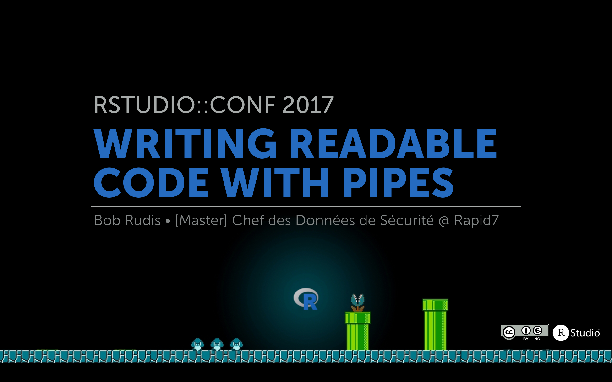

Slides, data and some code from rstudio::conf 2017

NOTE: the "satcat" code snippets which were intended solely to show how to pipe are now in a small [API pkg](https://github.com/hrbrmstr/satcat)

